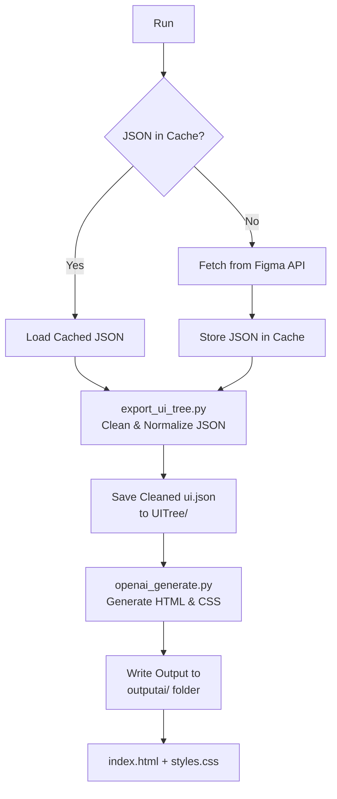

# Figma-to-Code Automation
This project converts Figma designs into clean, accurate HTML + CSS using a 3-step pipeline:
* Fetch raw JSON from Figma
* Clean & normalize it into a minimal UI tree
* Send cleaned UI tree to OpenAI to generate final HTML/CSS

## 🚀 Features
✔️ Fetch Figma JSON (with caching) 
> Makes sure we don't receive "requests.exceptions.HTTPError: 429 Client Error: Too Many Requests for url: https://api.figma.com/v1/files/"

✔️ Clean UI nodes into a usable structure  
✔️ Pixel-perfect HTML/CSS generation using OpenAI  

✔️ Uses strict prompt rules for accuracy  
✔️ Background Contrast Handling
> If the Figma frame is also white (common for UI mockups), the frame edges disappear completely in the browser. The contrast background prevents this and preserves clarity

✔️ Output: /ai/outputAI/output.html + styles.css  

## 📁 Project Structure (Flow chart available below)
See the [flowchart](#pipeline-flowchart) for an overview of the pipeline.  

``` bash
FIGMA_EXTRACT/
│
├── ai/
│   ├── export_ui_tree.py                     # Cleans raw Figma JSON → produces minimal UI tree (ui.json)
│   ├── figma_api.py                          # Fetches raw JSON from Figma API + saves it to cache
│   ├── openai_generate.py                    # Sends cleaned UI tree to OpenAI → generates HTML + CSS
│   ├── UITree//ui.json                       # Stores cleaned UI tree files (ui.json)
│   ├── outputAI/                             # Final AI-generated output folder (output.html + styles.css)
│   ├── util.py                               # Figma JSON loader + cache helper.
│   └── __init__.py

├── cache/
│   └── <FILE_KEY>.json                       # Raw Figma JSON fetched from API (cached per file)
│
├── templates/                                # Jinja2 HTML templates (used by classic pipeline) 
├── classic/                                  # Old non-AI pipeline (baseline HTML/CSS converter) - Version 1
│   ├── css_html.py                           # Classic CSS generator (absolute positioning, flex logic, etc.)
│   ├── figma_api.py                          # Classic version of Figma API fetcher
│   ├── main.py                               # Classic conversion pipeline entrypoint (no AI)
│   ├── mapper.py                             # Converts raw Figma JSON into intermediate node structure
│   └── output/                               # Classic HTML/CSS output
│
├── README.md
├── .env                                      # Holds API keys (OPENAI_API_KEY, FIGMA_ACCESS_TOKEN)
└── sampleOutputAI.jpg                        # Example AI-generated HTML/CSS screenshot

```

## 🔧 Installation
After git clone:  
``` bash
pip install -r requirements.txt
```
Create .env:
```
OPENAI_API_KEY=your-openai-key
FIGMA_ACCESS_TOKEN=your-figma-token
```
## ▶️ Usage
### 1️⃣ Fetch Figma JSON + Clean

```bash
cd ai
python export_ui_tree.py <FILE_KEY> --node <NODE_ID>
```
> [!IMPORTANT]
> 
> Pink- `<file-key>` of figma file  
> Yellow- `<node-id>` for the frame we want HTML CSS  
> Example:  
> ### <ins> **`python export_ui_tree.py f6gbTssaVTU0ik3u1q0cxL --node 1:75`** </ins>


Saves -> cache/<file_key>.json  
Saves -> UITree/ui.json

### 2️⃣ Generate HTML + CSS via OpenAI
```bash
python openai_generate.py
```
Outputs in ai/outputai:
```
ai/outputAI/output.html
ai/outputAI/styles.css
```
Open the HTML file in your browser.


## ⚡ Classic Renderer vs. AI Renderer
**_(Why the project has two modes — “classic/” and “ai/”)_**  
1. A classic rule-based exporter (Python/jinja2/handwritten logic)
2. An AI-powered pipeline using OpenAI’s API (Python, GPT, robust cleaning, and prompt engineering)

This project originally included a Classic HTML/CSS generator, located in the classic/ directory.  
The Classic pipeline directly converted Figma’s raw JSON → cleaned UI tree → HTML/CSS using pure Python logic, without any AI assistance.  

<details>
  <summary>✅ Why the Classic renderer existed</summary>

  - Parse Figma’s JSON structure manually  
  - Compute absolute positioning and layout  
  - Translate fills, borders, fonts, and padding
  - Output static, pixel-accurate HTML & CSS
  - Recreate simple mobile screens reliably


</details>

_For simple or small frames, this worked extremely well. The sample Figma login screen rendered almost exactly like the original in the browser_

<details>
  <summary>⚠️ But Classic does NOT scale for real-world Figma files</summary>

  - Too many edge cases 
  - Handling every case in Python becomes  
    - extremely complex
    - error-prone
    - hard to generalize to new Figma files
  - Large Figma files overwhelm deterministic parsing

</details>

### **_Shift to AI-integration_**  
The AI mode takes a JSON file, cleans the JSON UI tree, and then sends it to the OpenAI API. It generates HTML/CSS that works for any Figma structure, eliminating the need for manual maintenance of hundreds of parsing rules. Below is the flowchart of how it works!

## Pipeline Flowchart
Click the summary below to expand the flowchart.  

<details>
  <summary>Show Pipeline Flowchart</summary>


</details>


## 📸 Example Output


## 🧩 Troubleshooting
> [!CAUTION]
> **Output HTML looks shifted or misaligned**
> * The frame might be zoomed in sometimes
>   
> **429 Too Many Requests:**
> * You are rate-limited by Figma; the cache system is designed to avoid repeat API calls.
> * The OpenAI API key has run out of quota or credits. Check your plan and billing details in the OpenAI dashboard, or switch to a key with available usage.
>  
> **ModuleNotFoundError or ImportError:**  
> * Always run scripts from the project root (`FIGMA_EXTRACT/ai`) for import and path consistency.


